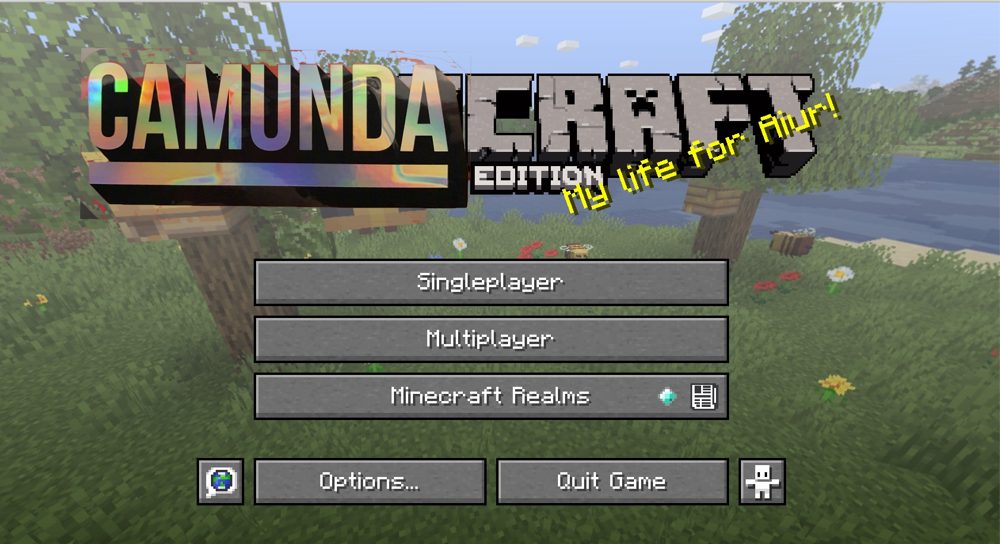

# Camunda Minecraft Plugin



_Orchestrate Minecraft with BPMN and JavaScript!_

The Camunda Engine embedded in a Minecraft plugin for Bukkit-compatible Minecraft servers.

The plugin has a single delegate method for task execution. The executor uses a field injection named `delegate` from a service task.

It uses the value of this field to look up a JavaScript handler in a map.

Register the handlers using the `registerHandler(name, code)` method. See the example below.

## Try it out!

If you have docker and npm installed, it is easy to test using the [Scriptcraft Modular Architecture](https://github.com/Magikcraft/scriptcraft-modular-arch) image.

Run: 

```
npm i -g smac
mvn package
smac
```

This will start a Minecraft server in Docker and mount the plugin into it.

It will pipe the server log to your terminal, and - _bonus!_ - give you an interactive session.

When the server finishes booting, type: `ts on`. This turns the terminal into a TypeScript REPL on the server. _Magic_.

Now paste these commands in:

```typescript
const xml = `<?xml version="1.0" encoding="UTF-8"?><bpmn:definitions xmlns:bpmn="http://www.omg.org/spec/BPMN/20100524/MODEL" xmlns:bpmndi="http://www.omg.org/spec/BPMN/20100524/DI" xmlns:dc="http://www.omg.org/spec/DD/20100524/DC" xmlns:di="http://www.omg.org/spec/DD/20100524/DI" xmlns:camunda="http://camunda.org/schema/1.0/bpmn" xmlns:xsi="http://www.w3.org/2001/XMLSchema-instance" id="Definitions_0fr9mxs" targetNamespace="http://bpmn.io/schema/bpmn" exporter="Camunda Modeler" exporterVersion="3.5.0"><bpmn:process id="my-project-process" isExecutable="true"><bpmn:endEvent id="EndEvent_0x6ir2l"><bpmn:incoming>SequenceFlow_0krhw54</bpmn:incoming></bpmn:endEvent><bpmn:startEvent id="StartEvent_1"><bpmn:outgoing>SequenceFlow_0tmt5j8</bpmn:outgoing></bpmn:startEvent><bpmn:sequenceFlow id="SequenceFlow_0tmt5j8" sourceRef="StartEvent_1" targetRef="say-hello" /><bpmn:sequenceFlow id="SequenceFlow_0krhw54" sourceRef="say-hello" targetRef="EndEvent_0x6ir2l" /><bpmn:serviceTask id="say-hello" name="Say Hello" camunda:class="io.magikcraft.camunda.Executor"><bpmn:extensionElements><camunda:field name="delegate"><camunda:string>someFunction</camunda:string></camunda:field></bpmn:extensionElements><bpmn:incoming>SequenceFlow_0tmt5j8</bpmn:incoming><bpmn:outgoing>SequenceFlow_0krhw54</bpmn:outgoing></bpmn:serviceTask></bpmn:process><bpmndi:BPMNDiagram id="BPMNDiagram_1"><bpmndi:BPMNPlane id="BPMNPlane_1" bpmnElement="my-project-process"><bpmndi:BPMNShape id="EndEvent_0x6ir2l_di" bpmnElement="EndEvent_0x6ir2l"><dc:Bounds x="432" y="99" width="36" height="36" /></bpmndi:BPMNShape><bpmndi:BPMNShape id="StartEvent_0mjamr5_di" bpmnElement="StartEvent_1"><dc:Bounds x="179" y="99" width="36" height="36" /></bpmndi:BPMNShape><bpmndi:BPMNEdge id="SequenceFlow_0tmt5j8_di" bpmnElement="SequenceFlow_0tmt5j8"><di:waypoint x="215" y="117" /><di:waypoint x="270" y="117" /></bpmndi:BPMNEdge><bpmndi:BPMNEdge id="SequenceFlow_0krhw54_di" bpmnElement="SequenceFlow_0krhw54"><di:waypoint x="370" y="117" /><di:waypoint x="432" y="117" /></bpmndi:BPMNEdge><bpmndi:BPMNShape id="ServiceTask_07166wq_di" bpmnElement="say-hello"><dc:Bounds x="270" y="77" width="100" height="80" /></bpmndi:BPMNShape></bpmndi:BPMNPlane></bpmndi:BPMNDiagram></bpmn:definitions>`

const c = server.getPluginManager().getPlugin("CamundaPlugin")

c.registerHandler("someFunction", "function(execution) { var process = execution.getProcessInstanceId(); console.log('Yay!!! The job handler was called from process instance ' + process )}")

c.deployBpmn("model.bpmn", xml);

c.runtimeService.createProcessInstanceByKey("my-project-process").execute()
```

You will see the handler execute:

```
[02:14:06 INFO]: [CamundaPlugin] Yay!!! The job handler was called from process instance 24
```

_Epico!_

To shut down the server, type: `smac stop`.